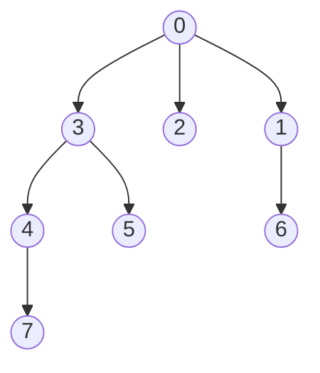

# CENG519 Network Security - Term Project

The Dockerfile is used to create a container that establishes the development environment for CENG519. The required packages (Microsoft SEAL and EVA) have already been installed. Networkx is also installed for graph generation. The goal of the project is to implement a graph algorithm that preserves the privacy of the graph. Note that CKKS used by EVA is not powerful enough to perform all kinds of computations, such as comparison.

## Algorithm: Determine whether two nodes lie on the same path in an encrypted tree

Given an encrypted tree and an encrypted query consisting of two nodes (u, v), the task is to determine if the two nodes lie on the same path. Normally, this could be efficiently implemented on unencrypted graphs by making use of depth-first search (DFS). However, this is not the case when dealing with homomorphically encrypted graphs since only basic arithmetic operations such as addition, subtraction, and multiplication are allowed. Therefore, we implement the algorithm by using homomorphic matrix multiplication to construct the transitive closure of the graph, which we then use to determine whether the given nodes are on the same path or not.

### Example
iven the tree below, the output for (0, 7), (3, 6), (3, 5), and (1, 4) should be as follows:
True, False, True, False



It should be noted that changing the order of the input will not affect the result; i.e., it is commutative.

# Running the example
```
# Build the docker image
docker build --progress=plain -t projectfhe .

# Run the image as a container
docker run -it projectfhe /bin/bash

# Attach a shell from the executing container called projectfhe 
(if using Visual Studio). Otherwise, a shell should've opened automatically 
in terminal pointing to /development, which contains EVA, SEAL, Project

# Run the program 
python3 Project/fhe_samepathchecker.py
```
